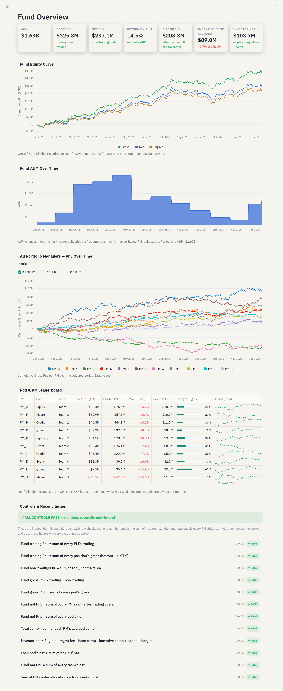
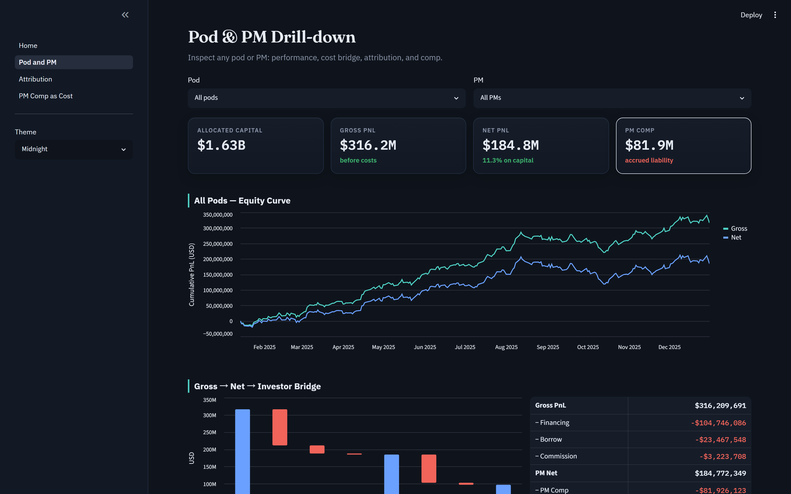
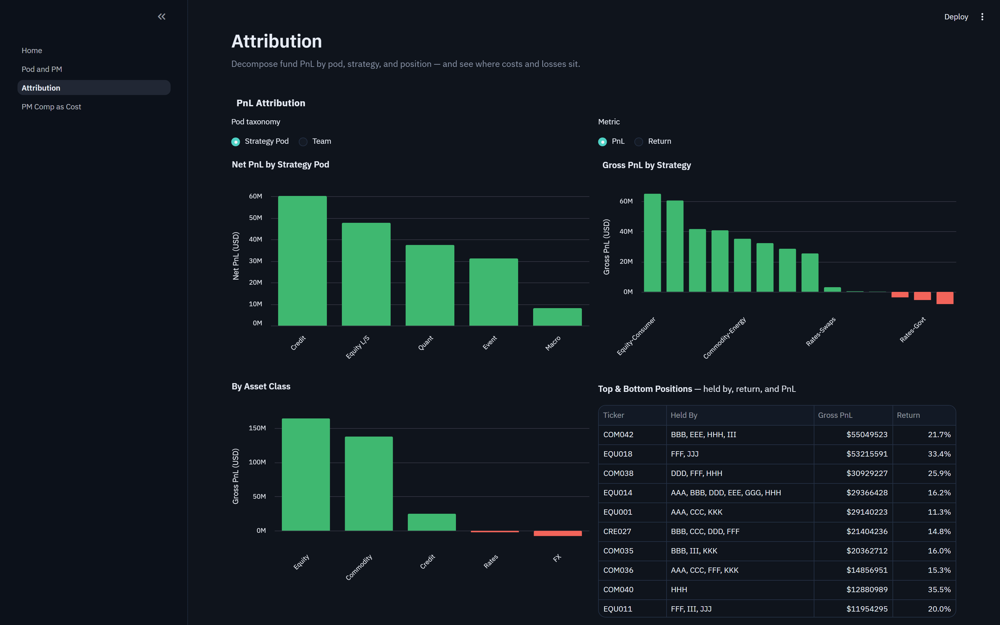
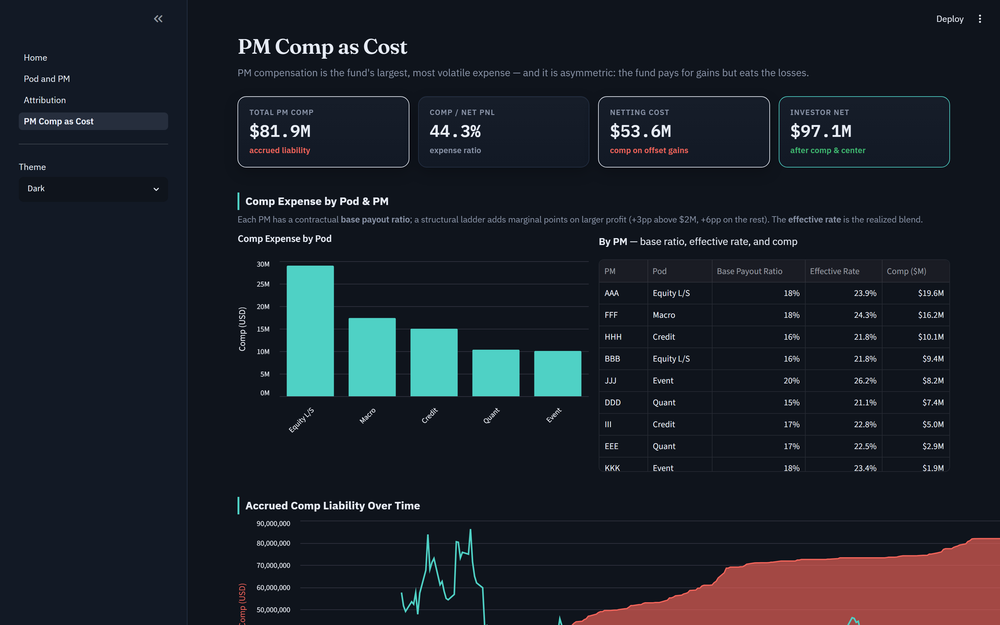
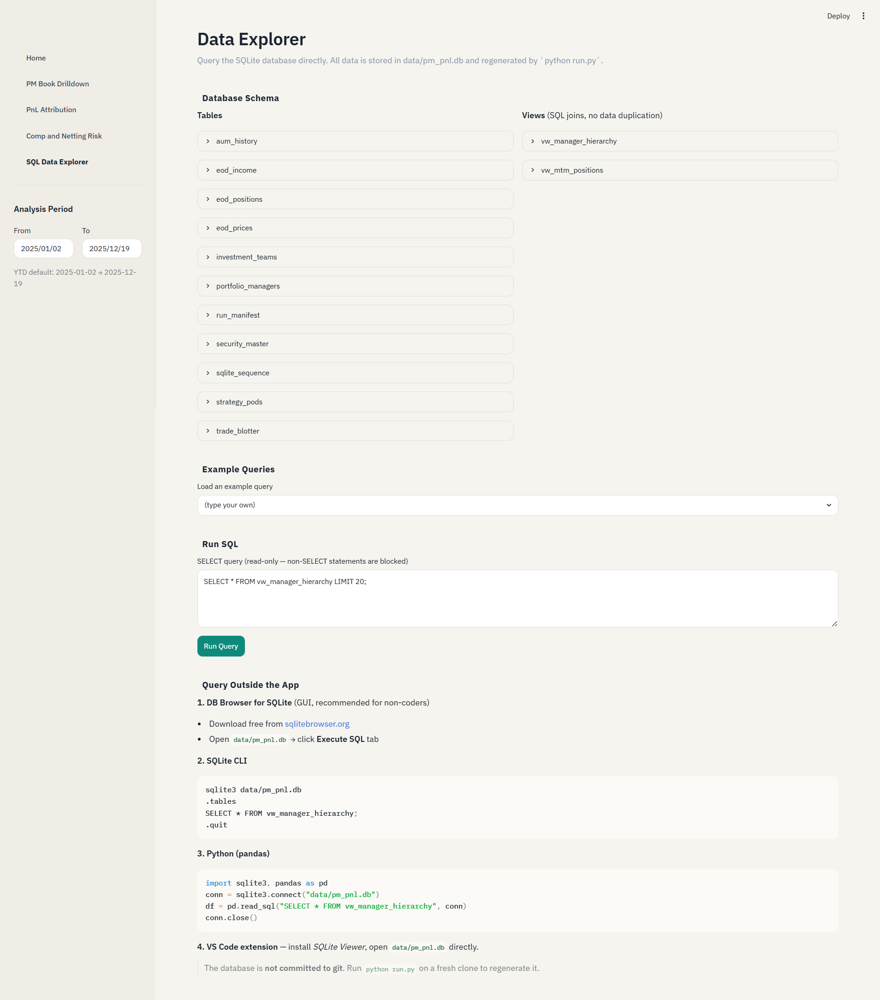

# PM PnL Dashboard — Multi-Pod Hedge Fund Finance

A polished, fast Streamlit dashboard that a multi-Pod hedge fund's **finance team**
uses to translate raw PM trading performance into the fund's own economics:
accruing PM compensation as a liability, owning the Gross→Net bridge, quantifying
netting risk, and reporting what investors actually net.

> **What this demonstrates:** not a pretty chart, but a *finance automation
> engineer's* deliverable — a one-command, reproducible, **unit-tested**,
> **config-driven**, **reconciled** pipeline that finance can trust to compute
> real money. It replaces a manual month-end stitch of prime-broker statements +
> OMS positions + comp spreadsheets (~2–3 days) with **seconds** (`python run.py`).

📖 The *why* and the *how* live in [`docs/`](docs/):
[business context](docs/business_context.md) ·
[methodology & formulas](docs/methodology.md) ·
[data model](docs/data_model.md).

---

## What you get

- **5-page dashboard** (Fund Overview, Pod & PM Drill-down, Attribution, PM Comp as Cost, SQL Data Explorer)
- **Tested calculation engine** — 59 pytest cases vs hand-computed values
- **Live Controls & Reconciliation panel** — Fund = ΣPod = ΣPM = ΣTeam, comp ties out, investor-net identity holds
- **Config-driven** — change one value in `config/assumptions.yaml`, everything recomputes
- **Structural comp** — contractual base payout + tiered marginal ladder + prior-year loss carryforward
- **Two pod taxonomies** — group by strategy pod or by cross-strategy team (a toggle on each page)
- **Decision tool** — a payout-ratio slider recomputes comp & investor net live, with the current ratio marked
- **Polished Altair charts** — zoom, tooltips, angled labels, a Gross→Net waterfall (pure-Python, bundled with Streamlit; no Plotly/matplotlib)
- **Dynamic AUM** — fund AUM evolves monthly via performance-based PM reallocation + net investor flows; the `aum_history` table feeds the `center` and `capital_charge` deductions daily and is charted on the Home page
- **Native theming** — refined dark & light themes in `config.toml`; charts, cards, and tables follow the theme automatically (switch via the app's ☰ → Settings)

---

## Architecture

```
config/assumptions.yaml ──┐
                          ▼
        src/data_gen/generate.py ──► data/pm_pnl.db  (SQLite)
                          │            (strategy_pods, portfolio_managers, security_master,
                          │             eod_prices, eod_positions, eod_income, aum_history)
                          ▼
        src/loader.py  ── compute_all() ──► src/engine/
                          │                   pnl → costs → payoff
                          │                   → attribution → economics → recon
                          ▼
        ┌─────────────────────────────────┐      run.py
        │ app/Home.py + app/pages/1,2,3,4 │   one command:
        │ (native st.* charts, theme CSS) │   generate→compute→reconcile→test
        └─────────────────────────────────┘
```

---

## Prerequisites

- **Python 3.11+**
- ~200 MB disk for the virtual environment and generated database

---

## Install

```bash
# from the repo root
python -m venv .venv
source .venv/bin/activate          # Windows: .venv\Scripts\activate
pip install -r requirements.txt
```

> **Windows note:** if `python` opens the Microsoft Store (a stub) instead of
> running, use the `py` launcher: `py -m venv .venv` then
> `.venv\Scripts\python.exe -m pip install -r requirements.txt`.

---

## Run the pipeline (recommended first step)

```bash
python run.py
```

This runs the whole thing end-to-end and is safe to put in CI:

1. **generate** synthetic data → `data/pm_pnl.db` (SQLite)
2. **compute** all engine outputs
3. **reconcile** — prints the R1–R7 tie-out table; **exits non-zero if any break**
4. **test** — runs `pytest tests/`

On success it prints the command to launch the dashboard.

---

## Launch the dashboard

```bash
streamlit run app/Home.py
```

Streamlit opens a browser at `http://localhost:8501`. Use the left sidebar to move
between the five pages.

> If you launch the app *without* running the pipeline first, generate the data
> once with `python -m src.data_gen.generate`.

---

## How to use each page

### 🏦 Home — Fund Overview
The CEO/LP landing page. KPI cards (AUM, Gross, Net, **PM Comp Expense**, Investor
Net), the fund equity curve (Gross vs Net — the gap *is* the cost bridge, drag to
zoom), the **fund AUM over time** chart (monthly reallocation + investor flows), a
Pod & PM leaderboard (toggle **Strategy Pod / Team**) with 3-month trend sparklines
and a comp/net bar, and the **Controls & Reconciliation** panel.
**All-green = trustworthy.** Switch **light / dark** from the app's ☰ → Settings menu.

### 🔍 Pod & PM — Drill-down
Pick a **Pod** (or **All pods**), then a **PM** (or "All PMs"). You get that
selection's KPIs, equity curve, the **Gross → Net → Investor bridge** as a
**waterfall** plus an income-statement table (deductions in red, bold subtotals),
strategy/position attribution (top & bottom positions with **who holds them** and
each position's return), and the **High-Water Mark vs cumulative net** with the
accrued-comp liability and any prior-year loss to recover.

### 🧭 Attribution
Where PnL, cost, and loss come from. Toggle **PnL / Return** and **Strategy Pod /
Team**: PnL (or return) by pod/team, by strategy, by asset class, top & bottom
positions (with holders and returns), a richer **cost breakdown** (by pod / team /
PM, with cost-to-gross ratios to show whether performance is revenue or cost
control), and a **risk-vs-return scatter** (one color per PM, hover for the name).

### 💰 PM Comp as Cost  *(the finance centerpiece)*
Comp expense by pod and **by PM with each PM's contractual base payout ratio and
realized effective rate**, the **accrued comp liability over time** (with its share
of net PnL), the **netting-risk** callout, and the **decision tool**: a payout-ratio
slider that **recomputes comp and investor net live**, plus a sensitivity curve with
the **current ratio marked**.

### 🗄️ SQL Data Explorer
A live SQL query console against `data/pm_pnl.db`. Browse any raw table, run ad-hoc
queries, and verify that the numbers you see on other pages come directly from the
source data — closing the audit loop. Supports the full SQLite dialect; results render
as a paginated dataframe.

---

## Editing assumptions (config-driven)

Everything economic lives in [`config/assumptions.yaml`](config/assumptions.yaml):
payout ratios, hurdles, financing/borrow/commission rates, center cost, GBM/factor
parameters, and the pod/PM rosters. **No numbers are hardcoded in the engine.**

Try it: change a PM's `payout_ratio`, then re-run:

```bash
python run.py            # pipeline + reconciliation reflect the change
streamlit run app/Home.py
```

No code edits required — that is the "system, not a one-off script" proof point.

---

## Screenshots

### 🏦 Fund Overview
KPI cards, the Gross-vs-Net fund equity curve, the Pod & PM leaderboard, and the live
Controls & Reconciliation panel.



### 🔍 Pod & PM Drill-down
Per-selection KPIs, equity curve, and the Gross → Net → Investor bridge.



### 🧭 Attribution
Net PnL by pod, Gross PnL by strategy and asset class, and top contributors/detractors.



### 💰 PM Comp as Cost
Comp expense by pod/PM, the comp/net ratio, netting-risk callout, accrued comp
liability over time, and the `payout_ratio` sensitivity tool.



### 🗄️ SQL Data Explorer
Live query console against `data/pm_pnl.db` — browse raw tables, run ad-hoc SQL,
close the audit loop between dashboard numbers and source data.



> To regenerate these after a UI change: run the app, then re-capture each page into
> `docs/images/` (filenames `01_Home.png` through `05_SQL_Data_Explorer.png`).

---

## Testing

```bash
pytest tests/ -q
```

59 tests validate the engine against hand-computed values: MTM roll-up, the
Gross→Net→Eligible bridge, HWM crystallization (including an underwater PM earning
**0** comp), the tiered comp ladder, prior-year loss carryforward, netting cost,
non-trading income, dynamic AUM history, and every reconciliation tie-out (R1–R7).

---

## Troubleshooting / FAQ

**`FileNotFoundError: Missing data tables ...`**
Generate the data first: `python -m src.data_gen.generate` (or just `python run.py`).

**`ModuleNotFoundError: No module named 'src'` / `'app'`**
Run commands from the **repo root** with the virtualenv activated. The app pages add
the repo root to `sys.path` automatically; the pipeline relies on the working dir.

**The dashboard is empty or stale after I changed the config.**
Streamlit caches computed results. Press **"R"** (or use the menu → *Rerun*) to
rerun; for a hard refresh, *Clear cache* from the app menu. `run.py` always
regenerates from scratch.

**The fund is losing money / numbers look off after editing config.**
The synthetic fund's profitability is driven by per-PM `skill` and cost rates in the
config. Extreme edits (very high financing rate, all-negative skill) will make it
unprofitable — that is the model working, not a bug.

**Can I use a different number of PMs/pods/instruments?**
Yes — edit the `pods`/`pms` lists and `n_instruments` in the config and re-run. Keep
each pod's PM capital summing to the pod's `allocated_capital` for a clean read.

**Reconciliation shows a red FAIL.**
That means an identity broke — the numbers are not safe to trust. Re-run the pipeline;
if it persists, a config or engine change violated an invariant. See
[methodology §7](docs/methodology.md).

---

## Project layout

```
pm_pnl_dashboard/
├─ README.md                  # this file (how to run & use)
├─ docs/                      # methodology, data model, business context
├─ config/assumptions.yaml    # all economic assumptions (config-driven)
├─ run.py                     # one-command pipeline
├─ requirements.txt
├─ .streamlit/config.toml     # dark/light financial theme
├─ data/pm_pnl.db             # generated SQLite database (run `python run.py`)
├─ src/
│  ├─ config.py               # YAML loader + blended payout
│  ├─ db.py                   # SQLite read/write helpers
│  ├─ data_gen/generate.py    # synthetic data (factor model + skill + AUM history)
│  ├─ engine/                 # pnl, costs, payoff, attribution, economics, recon
│  └─ loader.py               # cached loaders + compute_all()
├─ app/
│  ├─ Home.py                 # Fund Overview
│  ├─ pages/                  # 1 Pod & PM · 2 Attribution · 3 PM Comp as Cost · 4 SQL Explorer
│  └─ components/             # theme, kpi cards, controls panel, charts
└─ tests/                     # 59 pytest cases vs hand-computed values
```
